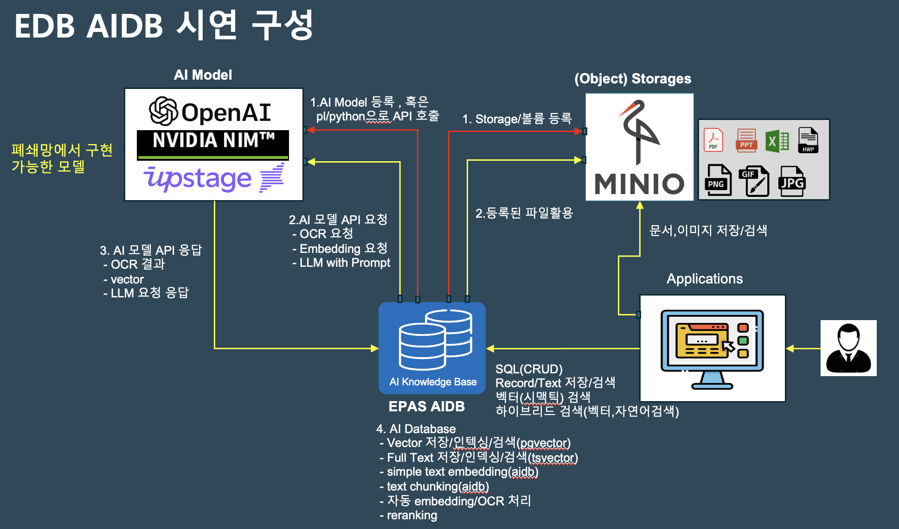

# epas-aidb-minio-demo

EDB EPAS의 AIDB 확장팩에 대한 데모 자료입니다.  

1. Minio 구성은 별도로 하여야 합니다.  
   aidb-bucket을 만들고 Documents 폴더와 Images 폴더를 Upload 하면 됩니다.  
2. AI 모델은 AIDB 내장, NVIDIA NIM, OPENAI embedding/completions 을 사용하였습니다.  
3. EDB EPAS17 의 postgresql.conf에 수정이 필요합니다. aidb 추가  
   shared_preload_libraries = 'aidb'

